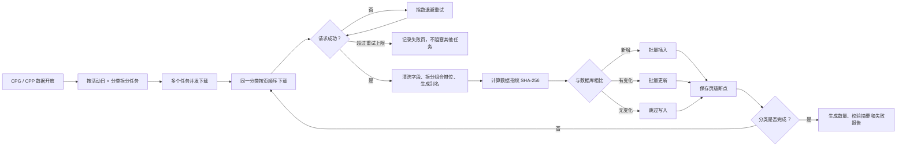
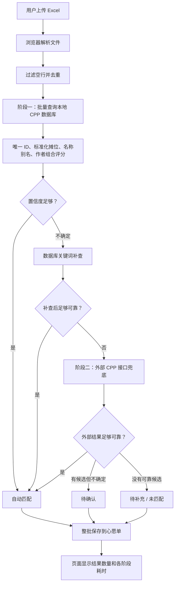
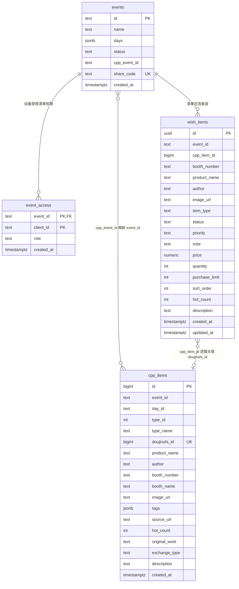
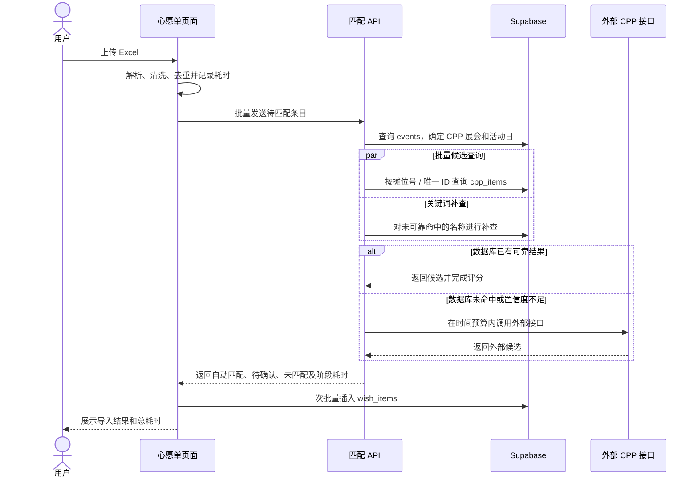

# CPP 数据与心愿单匹配：产品说明、验收方法和数据架构

> 更新时间：2026-07-19
> 适合读者：产品、运营、测试和研发
> 本文目标：解释 CPP 数据如何进入系统、用户上传的心愿单如何匹配，以及如何验收速度和准确性。

## 1. 一句话说明这次做了什么

系统现在把“准备 CPP 数据”和“匹配用户心愿单”拆成了两个可独立检查的环节：

1. 先稳定、完整地把 CPP/CPG 展品数据同步到自己的数据库；
2. 用户上传心愿单时优先使用自己的数据库匹配，只有找不到可靠结果时才尝试外部接口；
3. 系统只自动采用高置信度结果，拿不准的结果进入“待确认”，不再为了提高匹配数量而强行匹配；
4. 每次上传都会记录解析、数据库匹配、外部接口和保存耗时，可以判断慢在哪个环节。

对用户最直接的变化是：上传更快、批量数据不再逐条等待、误匹配风险更低，而且页面会告诉用户“自动匹配、待确认、未匹配”分别有多少条。

## 2. CPP/CPG 数据抓取做了什么

### 2.1 过去的主要风险

- 一个分类失败可能导致整次任务中止；
- 已经下载过的页面没有稳定断点，中断后可能从头再来；
- 每次可能重复写入大量没有变化的数据；
- 下载完成后缺少“源站有多少、数据库有多少、是否完整”的统一核对结果；
- 数据开放后很难在短时间内同时处理多个活动日和分类。

### 2.2 现在的产品能力

| 能力 | 产品含义 |
|---|---|
| 可重复执行 | 同一个展会可以安全地反复同步，不会因为重复运行制造重复数据 |
| 断点续传 | 下载中断后从未完成的页继续，不必全部重来 |
| 并发下载 | 不同“活动日 × 分类”可以同时执行，加快数据开放后的首轮入库 |
| 自动重试 | 网络波动或临时失败会自动退避重试 |
| 增量更新 | 只有新增或发生变化的展品才重新写入数据库 |
| 数据校验 | 每页生成摘要，任务结束输出源数据量、标准化后数量、数据库数量和失败明细 |
| 失败隔离 | 一个分类失败不影响其他分类继续完成 |
| 演练模式 | 可以不写数据库先检查字段结构、数量和流程是否正常 |

### 2.3 抓取与入库流程

### 2.4 如何判断一次同步是否成功

同步报告可能出现四种状态：

- `ok`：源数据完整，数据库覆盖数量满足要求，没有失败页；
- `limited`：人为设置了最大页数，只是演练，不代表完整下载；
- `partial`：部分任务失败，可以使用断点继续；
- `invalid`：流程执行结束，但数量核对不通过，需要人工检查。

产品上线判断应以 `ok` 为准，不能只看脚本是否退出。

## 3. 心愿单匹配做了什么

### 3.1 两阶段匹配

阶段一优先查本地数据库，速度更稳定，也不会受到外部接口登录状态和限流影响。阶段二只处理阶段一没有可靠命中的条目，并受到总时间预算和并发数限制。

### 3.2 系统如何判断“是不是同一个展品”

系统不是只做文字完全相等，而是同时考虑：

- CPP 展品唯一 ID：存在时优先级最高；
- 摊位号：统一全角/半角、空格，并识别组合摊位；
- 展品名称：去除标点差异，识别书名号、括号标题、CP32/新刊等常见前缀；
- 作者或社团：作为辅助特征；
- 组合得分：摊位约占 45%，名称约占 45%，作者约占 10%；
- 歧义检测：两个候选过于接近时不自动选择。

### 3.3 结果分级

| 页面结果 | 系统行为 | 产品解释 |
|---|---|---|
| 自动匹配 | 自动补充图片、作者、热度等 CPP 信息 | 系统认为结果足够可靠 |
| 待确认 | 保留用户原始信息；用户可在统一弹窗中逐条/批量“确认匹配”或“保留原始” | 有较可能的结果，但需要用户作最终选择 |
| 待补充 / 未匹配 | 保留用户上传内容，不关联 CPP 数据 | 没有找到可靠候选 |

质量目标定义为“自动匹配精确率 ≥ 95%”。召回率不会通过降低阈值强行提高，因为少匹配一条可以人工补充，匹配错一条更容易误导采购。

## 4. 当前性能与质量基线

| 测试场景 | 当前结果 |
|---|---:|
| 31 条人工标注集自动匹配精确率 | 100.00% |
| 31 条人工标注集召回率 | 96.15% |
| 31 条人工标注集误匹配率 | 0.00% |
| 5 次真实 HTTP 匹配 P95 | 6.26 秒 |
| 7 条真实 Excel、20 次运行 P95 | 1.69 秒 |
| 200 条真实 CPP 字段、20 次运行 P95 | 8.04 秒 |
| 性能目标 | P95 ≤ 30 秒 |

这组结果说明现有样本已经通过性能和自动匹配精确率门槛，但 31 条标注数据还不足以证明所有 CPG 分类都达到 95%。CPG 上线前仍需补充至少 200–500 条分层人工标注数据。

## 5. 产品验收步骤

使用项目提供的“CPP心愿单上传验收.xlsx”：

1. 打开本地测试页面并新建一个“CP32一期”心愿单；
2. 进入该心愿单，点击“上传心愿单”；
3. 上传 Excel 的第一张表“上传测试”；
4. 等待页面出现导入结果；
5. 记录页面显示的总耗时、解析耗时、匹配耗时和落库耗时；
6. 对照第二张表“标准答案”检查自动匹配、待确认和未匹配结果；
7. 重点检查“不应自动匹配”的负样本，确认它们没有被错误关联；
8. 再次上传同一文件，确认系统提示内容已存在，不会重复添加。

这份 21 条验收文件在本地接口复测中的基线为：

- 自动匹配 16 条；
- 待确认 1 条；
- 未匹配 4 条；
- 自动匹配精确率 100%；
- 三次上传解析加匹配 P95 约 4.32 秒。

剩余待确认是有真实歧义或名称明显不一致的候选；4 条负样本均为未匹配，没有发生错误自动匹配。

验收标准：

- 总耗时小于 30 秒；
- 自动匹配结果中，错误结果不超过 5%；
- 负样本不能被强行自动匹配；
- 待确认项保留原始上传内容并带有候选备注；
- 相同文件重复上传不会制造重复条目。

## 6. 当前线上四张核心表

以下字段来自对当前 Supabase 的只读探测。迁移 `005_cpp_sync_metadata.sql` 中的标准化字段尚未出现在线上 `cpp_items` 表中，因此在图中单独标为待迁移能力。

### 6.1 每张表负责什么

| 表 | 产品角色 | 关键关系 |
|---|---|---|
| `events` | 一张展会心愿单的入口和基本信息 | `id` 标识用户清单；`cpp_event_id` 指向用于匹配的 CPP 数据范围 |
| `event_access` | 哪台设备可以看到哪张清单 | 同一个清单可对应 owner/viewer 多台设备 |
| `wish_items` | 用户最终要购买或领取的展品条目 | 通过 `event_id` 属于某张清单；匹配成功时保存 CPP 标识 |
| `cpp_items` | 从 CPP/CPG 同步回来的标准展品库 | 按展会、活动日、分类存储，是自动匹配的主要数据源 |

### 6.2 需要特别注意的逻辑关系

1. `events.cpp_event_id → cpp_items.event_id` 是应用层映射，不是数据库外键；
2. `wish_items.cpp_item_id` 当前实际保存的是 `cpp_items.doujinshi_id`，不是 `cpp_items.id`；
3. `wish_items.event_id` 当前也没有显式数据库外键；
4. `event_access.event_id` 有正式外键，删除清单时会级联删除设备访问关系；
5. 迁移 005 执行后，`cpp_items` 会增加标准化字段、别名、数据指纹、源更新时间和抓取批次 ID，用于增量同步和更快匹配。

## 7. 页面、接口与数据库如何交互

## 8. 后续产品建议

1. 执行迁移 005，使新增同步元数据和标准化字段真正上线；
2. 建立 CPG 的 200–500 条真实标注集，并按活动日、分类和摊位类型分层；
3. 把每次匹配指标写入独立的 `match_runs` 表，才能长期查看线上 P50/P95 和准确率趋势；
4. 将用户确认结果回灌为别名或标注样本，提高后续匹配覆盖率；
5. 将 `wish_items.cpp_item_id` 改名或建立正式外键，消除“字段名指向 id、实际保存 doujinshi_id”的歧义。
