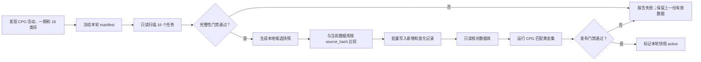

# CPG 单期 16 类目数据同步策略

> 状态：首轮 CPG08 数据已写入生产；字段更新脚本、每两日 GitHub Actions 与人工触发入口已建立。同步仍遵守“新增插入、有效字段更新、来源缺失不删除”。
> 目标：CPG 数据开放后，以可证明完整、失败可恢复、日常只写变化记录的方式支持 list 上传匹配。

## 1. 已确认边界

- CPG 只有一期，对应一个 CPP `day_id`。
- CPG 页面应展示且只接受 16 个制品类目。
- 16 个类目构成第一层完整分区；不存在无法归入类目的制品。
- 产品和数据库内部展会标识固定为 `cpg08`，CPP source event 固定为 `7073`；scanner 从活动页动态发现并冻结恰好一个正整数 `day_id`，当前真实值为 `7829`。类目 ID/名称同样动态发现并冻结。
- 真实 event HTML 不含总数字段。官方 `eventAllDoujinshi.js` 使用无 type 过滤的 `/api/doujinshi/search.do` envelope `result.total` 渲染页面总数；scanner 使用同一只读 GET 契约动态冻结总数。`38188`、`38204` 等观测值都不是行为常量。
- CP32 只作为抓取和匹配方法的回归样本，不要求补齐 CP32 生产数据。
- 同步不得修改用户的 `events`、`wish_items`、成员关系或历史 list。

一轮 CPG 同步固定包含：

```text
1 个 day_id × 16 个 type_id = 16 个同步任务
```

数据库中的制品身份键保持为：

```text
event_id + day_id + doujinshi_id
```

`type_id/type_name` 是需要校验的来源属性，不作为同一制品重复入库的理由。一个制品在同一期意外出现在多个类目时，本轮同步必须进入人工复核。

## 2. 总体流程



抓取与写库是两个阶段。抓取阶段不得持有数据库写权限；只有完整快照通过门禁后，写入阶段才允许使用仅具备 `cpp_items` SELECT/INSERT/UPDATE 权限的服务端凭据。

## 3. 活动与类目发现

每轮开始先读取 CPG 活动页面，生成 manifest：

```json
{
  "internalEventId": "cpg08",
  "cppEventId": "7073",
  "dayIds": ["7829"],
  "types": [
    { "id": 0, "name": "以页面实际值为准" }
  ],
  "discoveredAt": "ISO-8601",
  "manifestHash": "SHA-256"
}
```

发现结果必须满足：

1. 活动页面的当前活动 ID 恰好为 `7073`，推荐活动链接不计为当前活动；
2. 动态发现恰好一个正整数 `day_id`，A/B 四次页面读取中保持稳定；当前真实值为 `7829`；
3. 恰好发现 16 个唯一 `type_id`；
4. 类目名称非空，`type_id` 与页面 `data-id` 一致；
5. 同一轮所有请求使用同一个冻结 manifest；
6. 每个 checkpoint 通过无 type 搜索独立取得 `result.total`，必须是正安全整数，四次结果相同；
7. definitionHash 不包含 `discoveredAt`，定义变化可稳定复现；
8. manifest 与上一轮不同时只生成差异报告，不自动写库。

首次 CPG manifest 需要人工确认一次。后续名称、ID、日期或类目数量发生变化时重新确认，避免重复 CP32 静态类目表漂移的问题。

## 4. 单类目完整性校验

每个类目单独分页，所有 CPP 请求使用全局串行限速器，默认请求间隔不低于 900ms，安全下限为 800ms。只重试 429、502、503、504，并遵守 `Retry-After`。

每个任务必须同时满足：

- 冻结第一页的 `total` 和服务端实际页宽；
- 非末页长度等于实际页宽，末页长度等于剩余数量；
- 所有非空页的 `total` 与冻结值一致；
- 只接受目标 CPG `day_id` 的 `eventList`；
- 每条记录具备合法 `doujinshi_id`、制品名称、类目和活动信息；
- 累计唯一 `doujinshi_id` 数等于冻结 `total`；
- 覆盖目标数量后读取到合法空 sentinel；
- 没有跨页重复、跨类目重复或同 ID 多摊位/社团冲突；
- 为每页和整个任务生成摘要哈希。

若某类目接近接口窗口上限（默认 `total >= 9500`），必须启用该类目的二级分区。当前最小扫描器尚未冻结可靠的二级分区维度，因此遇到该情况会 fail closed，不生成 `snapshot_ready`。未来支持时，二级分区必须使用 CPG 实际页面/API 支持且可穷举的过滤维度，并在 manifest 中明确列出。所有二级分区必须满足：

- 分区集合覆盖该类目全部制品；
- 每个制品至少被一个分区覆盖；
- 合并后按 `doujinshi_id` 去重；
- 每个分区独立满足分页完整性门禁；
- 分区并集通过第二种排序或第二次扫描核对。

达到 10,000 条但没有完成二级分区证明的任务不得标记完成。

## 5. 快照与运行状态

每轮运行状态只允许按以下顺序推进：

```text
discovered → scanning → snapshot_ready → promoting → verified → active
                  ↘ invalid / partial / blocked
```

- `snapshot_ready`：16 个任务全部通过，只读候选快照已生成。
- `active`：数据库核对和匹配质量均通过，是下一次同步的比较基线。
- `invalid/partial/blocked`：不写库，不替换上一份 active 快照。

报告至少记录：

- manifest 及其哈希；
- 16 个任务的声明数量、原始行数、唯一行数和页数；
- 重试、重复、冲突、封顶和失败明细；
- 全量快照哈希；
- 与上一份 active 快照相比的新增、变化、消失数量；
- 数据库写入前后的精确数量；
- `readOnly`、`dbWritesAttempted` 和最终状态。

日志与报告不得包含 Cookie、Secret key、Authorization header 或用户 list 数据。

当前 snapshot 另外固定包含 canonical rows（供 promotion 使用）、`definitionHash`、
`snapshotHash`、`tasksCompleted=16`、`tasksExpected=16`、动态 `declaredTotal`、
`readOnly=true` 和 `dbWritesAttempted=0`。promotion 只接受完整的
`snapshot_ready` 文件，并重新计算所有 hash 与 canonical row 的 `source_hash`。
当前 schema version 为 2，固定声明
`declaredTotalSource="cpp-unfiltered-search"`，并记录 A-before、A-after、
B-before、B-after 四次 count probe 的 checkpoint、day、空 typeIds、请求语义
版本、total、结果形状摘要与可重算 probe hash。validator 会逐 probe 重算；
snapshotHash 同时覆盖完整 countProbes。旧的 HTML
总数契约快照会被 validator 和 promotion 拒绝。

每个候选快照执行两次独立完整扫描。A 扫描前后、B 扫描前后均重新读取活动页，
并各自执行一次独立无 type count probe。四次读取的 event/day/16 类 topology
与 global total 必须一致。B 扫描按反向类目
顺序执行，以降低相同时间顺序掩盖漂移的概率。A/B 必须逐类满足 total、完整 ID
集合、canonical row hash 与 `source_hash` 集合完全一致；相同总数下等量替换 ID
或同 ID 内容变化都会失败。最终还要求：各类 total 之和、raw rows、canonical
rows 与全局 unique ID 数全部等于动态 global total。

live count probe 只允许 HTTP 200 JSON，必须满足 `isSuccess=true`、正安全整数
`result.total` 和数组 `result.list`。请求使用动态 day、空 `typeIds`、第一页和
小 pageSize，并复用全局串行限速/重试器。登录重定向、HTTP 401/403、200 HTML、
错误 content-type 或非法 envelope 均立即 fail closed，不生成快照。

正式 CPG 分类扫描与无 type count probe 都固定使用官方“最新”排序
`orderBy=0`。live 证据显示 type 36 使用 `orderBy=1` 时在 page 88 出现跨页重复，
同一时点使用 `orderBy=0` 可严格读取 4111/4111（有效页宽 40、103 页、零重复）。
因此不使用 `orderBy=1`，也不以未经同等证明的 `orderBy=3` 替代。排序值会写入
snapshot definition、A/B task 证明及 count probe 可重算 hash；任何排序证据
篡改都会失败。重复、total 漂移、短页和 sentinel 门禁没有放宽。

分类扫描使用有界 worker pool：默认 4 个分类 worker，硬上限 6；同一分类的分页
始终严格串行。A 的全部分类及合计门禁通过后才开始 B。任一 worker 失败即停止
调度新的分类，已在途请求收敛后整轮失败，不生成 snapshot。

所有分类请求与四次 global count probe 共享同一个请求启动限速器和 max in-flight
信号量。默认启动间隔 250ms（4 req/s，硬下限 250ms），默认 max in-flight=4、
硬上限 6。HTTP 429 是全局降速信号：遵守 `Retry-After`、暂停所有新 dispatch、
有效间隔至少翻倍；连续 100 个成功响应后才缓慢向配置值恢复。retry 保持原
type/page，不重复消费页。401/403、redirect、HTML 等认证失败不重试。

快照 definition 签名固定 `orderBy=0`、同类分页串行、A 后 B 与四个 probe
checkpoint；实际 worker 数和无敏感 request metrics 另行记录。metrics 包含
`requestStarts/retries/status429/maxInFlight/effectiveMinInterval/elapsedMs`，不含
Cookie、URL query 内容或响应正文。这样 concurrency=1 与 4 仍生成相同数据及
snapshotHash。

### 5.1 schema v3 dirty convergence（当前有效契约）

本节取代上文 schema v2、固定 A/B 四探针与“任一 source changing 即整轮失败”的
旧描述。并发和限速策略不变：默认 4 个分类 worker、最多 6；同类分页串行；所有
分类、global probe 与 barrier 的 16 类 page 1 请求共享 250ms 启动限速器和
max-in-flight semaphore。

1. 每类执行完整 scan epoch。total/sentinel total 漂移、短页、sentinel 覆盖不足
   或跨页重复视为 source changing，只废弃该类并从 page 1 重扫，最多 3 epochs。
   结构、认证、cap、非法 envelope/row 不重试；绝不拼接不同 epoch 的页面。
2. 16 类 candidate 完成后执行 barrier：并发读取 global count 和 16 类 page 1
   total。barrier total 与 candidate 不同只重扫对应 dirty 类；必须满足
   `global = sum(type totals) = union unique`，并取得连续两次一致 barrier，
   单次 barrier 最多 3 rounds。
3. barrier 后执行完整反向 validation pass，逐类比较 ID、canonical 与 source hash。
   mismatch 类以 validation 为新 candidate，只重扫 dirty 类获取第二个匹配 epoch；
   全局最多 8 个 convergence rounds，但每个 type 最多 3 次外层额外重扫；第四次
   重扫请求发出前即 blocked。之后重新取得连续双 barrier。
4. 最终每类必须保存两个连续匹配 full epoch。schema v3 的 snapshotHash 覆盖最终
   双 barrier/global/type totals、每类双 epoch、`dirtyRetries`、
   `convergenceRounds` 与 canonical rows。validator 和 promotion 明确拒绝 v2。

重复、分页完整性、topology、global/type/union、`orderBy=0` 和只读门禁没有放宽；
预算耗尽时不生成 `snapshot_ready`。

## 6. 首次全量同步

紧急 provisional 路径仅在显式 `scan:cpg -- --provisionalSinglePass` 时启用，默认仍为
strict v3。它只完整扫描 16 类一次，最终读取一次 global 与 16 类 totals；仅当
`sumTypeTotals=observedGlobal`，且 lag 与类内重复分别不超过
`max(100, ceil(observedGlobal*0.5%))` 时生成 v4 `snapshot_ready_provisional`。
promotion 默认拒绝 v4，必须显式增加 `--allowProvisional`，且仍执行 approved hash、
plan hash、加密恢复文件、写入和写后验证全部原有门禁。

1. 发现并人工确认 CPG manifest；
2. 对 16 个类目各跑一页 canary，确认字段和登录状态；
3. 执行完整只读扫描，生成候选快照；
4. 再执行一次只读核对：允许来源新增，但不允许无法解释的消失、重复或类目漂移；
5. 通过后创建新的可恢复备份；
6. 按 `event_id + day_id + doujinshi_id` 比较当前数据库；
7. 分批 upsert，仅插入不存在的记录、更新 `source_hash` 变化的记录；
8. 不执行 DELETE，不修改用户 list；
9. 写入后重新 SELECT，确认数量、ID 集合和字段哈希；
10. 运行 CPG 匹配黄金集；
11. 所有发布门禁通过后，才允许用户创建和导入 CPG list。

首次写入应在产品开放 CPG 入口之前完成，因此即使批量 upsert 中断，也不会向用户暴露半成品数据。重跑使用相同身份键和 `source_hash`，不会制造重复记录。

## 7. 每日增量同步

建议每天北京时间 03:00 运行一次，展会开放前再手动运行一次最终同步。

每日仍完整读取 16 个类目，但只写变化：

- 新 ID：`inserted`；
- 已有 ID 且 `source_hash` 变化：`updated`；
- hash 相同：`unchanged`，不写数据库；
- 本轮来源暂时未出现：只进入 `missingFromSource` 报告，不删除数据库记录。

任何类目失败时整轮不晋升为 active。线上继续使用上一份 active 数据，避免一次网络波动造成匹配数据倒退。

每日同步完成后必须验证：

- 16/16 任务完成；
- 无未解释的 manifest 变化；
- 候选快照通过完整性门禁；
- 数据库包含候选快照中的全部 ID；
- 更新数量与 hash 差异数量一致；
- 重复身份键为 0；
- 不存在目标 CPG 之外的活动日数据混入。

字段更新由版本化 `config/cpg-field-policy.v1.json` 驱动并受 whitelist 校验。当前
`hot_count` 是 volatile/search/daily；identity 不可变；stable 保持现有作者/社团
语义；normalized/aliases 为 derived。`description` 与 `exchange_type` 属于独立
detail 阶段且仅 `fillMissing`，搜索快照不得用空值覆盖已有详情。

## 8. 匹配质量策略

数据完整性和匹配算法质量分别统计，不能用外部 CPP 兜底掩盖数据库漏数。

CPG 首次开放前建立 200～300 条黄金样本：

- 16 个类目每类至少 10 条正样本；
- 覆盖完全一致、标点变化、名称前后缀、摊位格式差异、多作者、同名制品；
- 包含待确认样本和明确不应匹配的负样本；
- 第一批可以从已验证 CPG 快照生成带已知 ID 的扰动样本，随后用真实 CPP 心愿单替换或补充。

发布门禁：

| 指标 | 门槛 |
|---|---:|
| 黄金集正样本的目标 ID 在数据库中存在 | 100% |
| 自动匹配精确率 | 不低于 95% |
| 误匹配率 | 不高于当前基线 |
| 召回率 | 不低于测试开始时记录的基线；当前参考为 92.31% |
| 完整 API P95 | 不高于 30 秒 |
| 类目样本覆盖 | 16/16 |

匹配报告额外拆分：

- 数据可用率：正确制品是否在数据库中；
- 候选召回率：正确制品是否进入候选集合；
- 自动接受精确率和召回率；
- 待确认率、未匹配率和外部兜底率；
- 按类目分组的质量指标。

这样可以区分“源数据没抓到”“数据库查询没召回”和“评分决策不正确”。

## 9. 运行位置与凭据

完整扫描可能持续数十分钟，不放在用户请求或普通 Cloudflare Worker 请求中执行。推荐使用支持定时和手动触发的长任务环境，保留本地手动运行作为故障回退。

凭据要求：

- `CPP_COOKIE` 只保存在任务环境 Secret；
- 数据抓取阶段使用数据库只读凭据；
- 写入阶段使用仅允许 `cpp_items` SELECT/INSERT/UPDATE 的服务端凭据；
- 不允许 anon/authenticated 客户端写 `cpp_items`；
- 报告作为私有任务产物保存，不提交 Cookie 或真实用户数据到 Git。

## 10. 实施顺序

1. 将 event6377 只读扫描器通用化为按 manifest 运行的 CPG 扫描器；
2. 用 CP32 fixture 保留分页截短、10,000 上限、类目漂移和跨页重复回归；
3. 让同步脚本复用扫描器的 manifest、分页和完整性判断，删除静态类目表；
4. 将“抓取快照”和“写数据库”拆成两个显式命令；
5. 增加 CPG 16 类目 fixture、运行报告和匹配黄金集；
6. 对已确认的 source event `7073` 只读发现唯一正整数 `day_id`（当前 `7829`）与 16 类目；
7. 完成首次 dry-run、备份、正式同步和写后验证；
8. 匹配门禁通过后开放 CPG；
9. 启用每日增量任务，并保留手动触发入口。

`app/page.tsx` 的当前产品契约是 `cpg08/7829`。本文早期草案中的 `cpg`，以及
`docs/init-db.sql` 中历史记录 `cpgz`，均为已知文档/初始化漂移，不是本轮
promotion 的合法目标；本实现不会修改旧初始化文件或触碰这些 event 的数据。
真实 day 确认前已创建且存储单日 `7073` 的 `cpg08` list 不做迁移；仅在 CPP
匹配查询范围解析时窄映射到 `7829`。其他 event、非单日或其他 day 组合保持原样。

## 11. 当前本地命令与 promotion 门禁

离线 fixture 验收（不需要 Cookie、数据库或网络）：

```bash
npm run scan:cpg -- --fixture --pageSize=1000
npm run test:cpg-snapshot
```

live 只读扫描必须显式提供进程环境 `CPP_COOKIE`，只发 CPP HTTP GET，不读取
`.dev.vars` 或 Cookie 文件，也不访问数据库。快照写入已忽略的
`.cpp-snapshots/`。

promotion 的第一步永远是 dry-run。必须显式提供冻结快照、人工批准的
snapshot hash、Supabase project ref、目标 `cpg08` 和 snapshot 冻结的唯一 day；数据库凭据只从
进程环境 `SUPABASE_CPP_PROMOTION_KEY` 读取：

```bash
npm run promote:cpg -- --snapshot=<file> \
  --approvedSnapshotHash=<snapshotHash> \
  --projectRef=<ref> --targetEvent=cpg08 --targetDay=7829
```

dry-run 输出稳定 `planHash` 及 `inserted/updated/unchanged/missingFromSource`。
正式写入还必须提供刚才人工批准的 `planHash`、同时绑定 snapshot/plan 的完整
确认串，以及独立 32-byte hex 恢复密钥：

```bash
set CPG_RECOVERY_KEY=<64 hex characters>
npm run promote:cpg -- --snapshot=<file> \
  --approvedSnapshotHash=<snapshotHash> --approvedPlanHash=<planHash> \
  --projectRef=<ref> --targetEvent=cpg08 --targetDay=7829 --write \
  --confirmPromotion=PROMOTE:<snapshotHash>:<planHash>
```

写入前先生成 AES-256-GCM 加密的 before-image/delta，并立即解密和 hash
自校验；不能生成或验证恢复证据时零写入。delta 只包含本次更新行的旧值和新增
身份 ID，不包含用户表。写入只对 snapshot 中新增或 `source_hash` 变化的行做
批量 upsert；来源暂缺只进入报告，不移除数据库记录。两阶段都只允许查询
`cpp_items` 的目标 `cpg08/<snapshot day>`，不调用 RPC，也不访问其他 event 或用户表。传入旧 `7073` 会在任何数据库读取前失败。

## 12. 统一 daily dry-run（已实现）

```powershell
npm.cmd run sync:cpg:daily
npm.cmd run test:cpg-daily
```

无参数只使用仓库 fixture，严格执行 scan → validate → promotion dry-run；任一阶段
失败即停止。产物默认在已忽略的 `.cpp-snapshots/daily/<run>/`，终端打印
snapshot/report/plan、diff 与下一步。命令没有 `--write`，真实写入仍只能使用第
11 节人工 promotion 命令。

显式 `--live` 才访问 CPP，显式 `--projectRef` 才读取目标数据库形成真实 diff，
两者均需另行授权和进程环境凭据。本轮没有运行，也没有配置 Windows Task
Scheduler、CI cron 或云定时器。详情抓取仅文档化为独立阶段，未重写旧爬虫。
